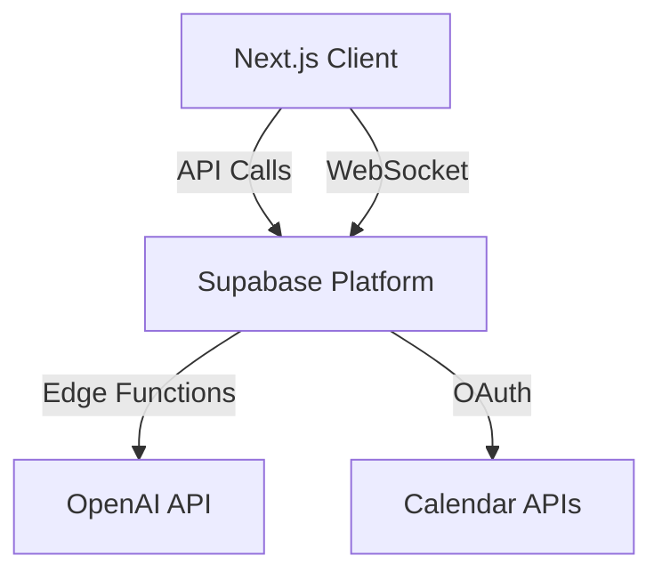
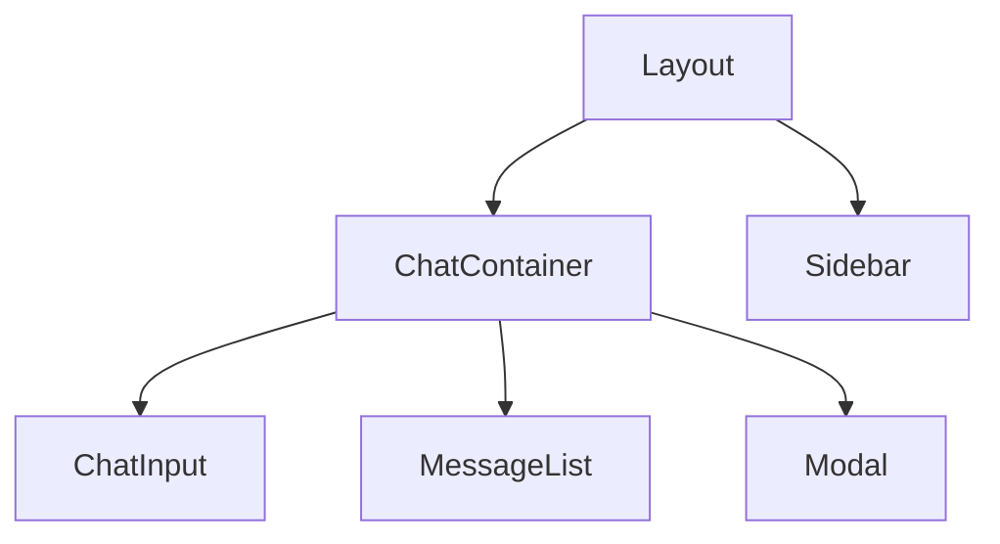
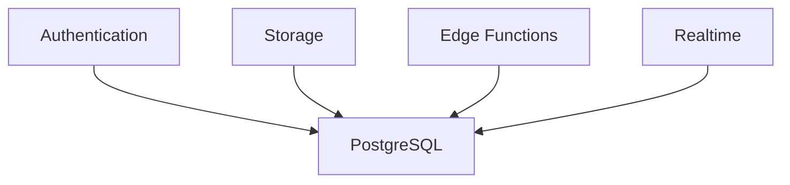
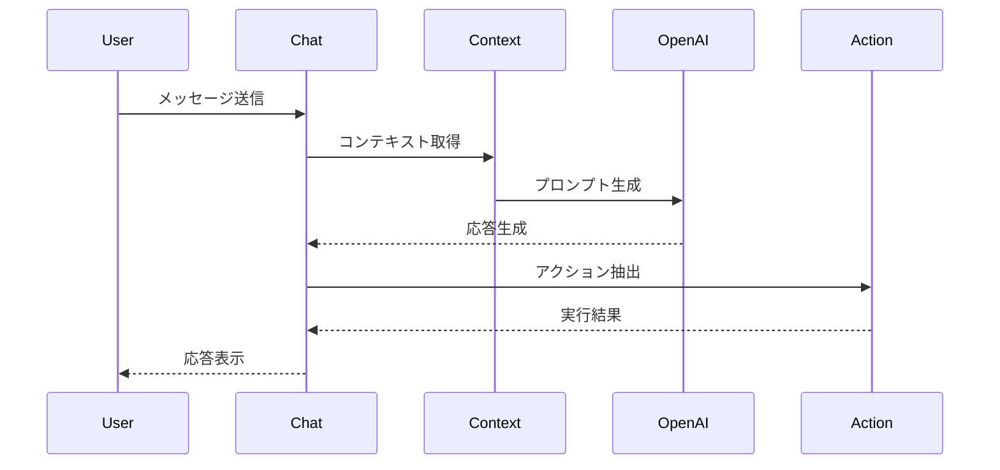
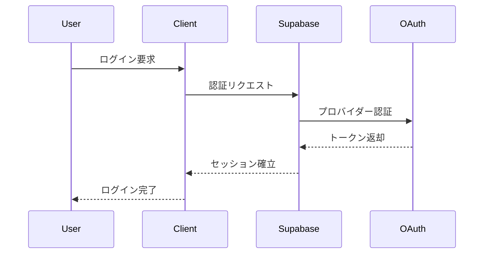
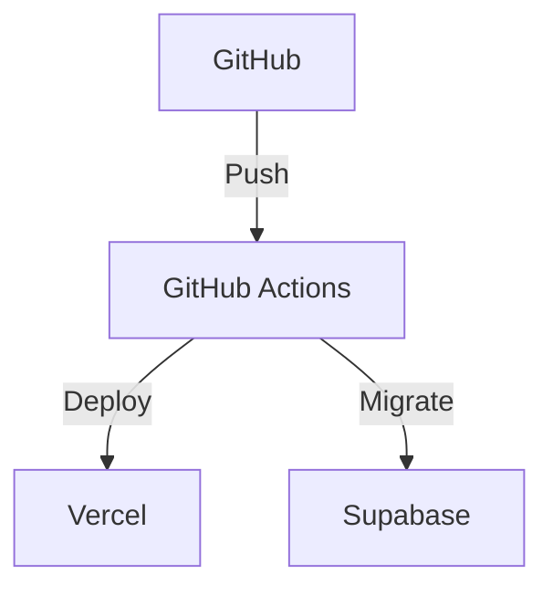
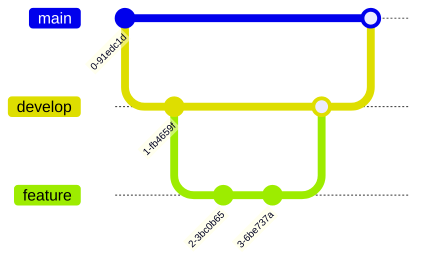

# COO 前田くん AI アーキテクチャ設計書

## 1. システム概要

### 1.1 アーキテクチャ概要



### 1.2 主要コンポーネント

- フロントエンド（Next.js）
- バックエンド（Supabase）
- AI 処理（OpenAI）
- 外部連携（Calendar APIs）

## 2. フロントエンド設計

### 2.1 ディレクトリ構造

```
src/
├── app/                    # App Router
├── components/             # UIコンポーネント
│   ├── chat/              # チャット関連
│   ├── shared/            # 共通コンポーネント
│   └── ui/                # 基本UIパーツ
├── features/              # 機能モジュール
│   ├── auth/              # 認証
│   ├── chat/              # チャット
│   ├── task/              # タスク
│   └── schedule/          # スケジュール
├── hooks/                 # カスタムフック
├── lib/                   # ユーティリティ
├── stores/                # 状態管理
└── types/                 # 型定義
```

### 2.2 コンポーネント構成



### 2.3 状態管理

```typescript
// stores/chat.ts
interface ChatStore {
  messages: Message[];
  context: ChatContext;
  session: ChatSession;
  actions: {
    sendMessage: (content: string) => Promise<void>;
    updateContext: (context: Partial<ChatContext>) => void;
    clearSession: () => void;
  };
}
```

## 3. バックエンド設計

### 3.1 Supabase 構成



### 3.2 データベース設計

```sql
-- スキーマ定義
create schema app_public;
create schema app_private;

-- RLS有効化
alter table app_public.users enable row level security;
alter table app_public.chat_sessions enable row level security;
alter table app_public.chat_messages enable row level security;

-- ポリシー設定
create policy "Users can see their own data"
  on app_public.chat_sessions
  for select
  using (auth.uid() = user_id);
```

### 3.3 Edge Functions

```typescript
// functions/chat/index.ts
export const onRequest = async (context: Context) => {
  const { req, res } = context;
  const { messages, sessionId } = await req.json();

  // OpenAI API呼び出し
  const completion = await openai.chat.completions.create({
    model: "gpt-4",
    messages: messages,
    temperature: 0.7,
  });

  return res.json(completion.choices[0].message);
};
```

## 4. AI 処理設計

### 4.1 対話処理フロー



### 4.2 コンテキスト管理

```typescript
interface ChatContext {
  sessionId: string;
  topic: string;
  entities: Entity[];
  lastAction: Action;
  metadata: Record<string, any>;
}

interface Entity {
  type: "task" | "schedule" | "kpi";
  id: string;
  reference: string;
}
```

## 5. セキュリティ設計

### 5.1 認証フロー



### 5.2 データアクセス制御

```sql
-- RLSポリシー
create policy "Users can only access their messages"
  on chat_messages
  for all
  using (
    auth.uid() = (
      select user_id
      from chat_sessions
      where id = chat_messages.session_id
    )
  );
```

## 6. インフラストラクチャ設計

### 6.1 デプロイメント構成



### 6.2 環境構成

```yaml
# 環境変数設定
environments:
  production:
    NEXT_PUBLIC_SUPABASE_URL: ${SUPABASE_URL}
    NEXT_PUBLIC_SUPABASE_ANON_KEY: ${SUPABASE_ANON_KEY}
    OPENAI_API_KEY: ${OPENAI_API_KEY}
    DATABASE_URL: ${DATABASE_URL}
```

## 7. パフォーマンス最適化

### 7.1 キャッシュ戦略

- SWR によるクライアントキャッシュ
- Supabase のキャッシュ層
- Edge Functions のキャッシュ

### 7.2 最適化手法

- 画像の最適化
- コードの分割
- プリフェッチ
- レスポンシブ画像

## 8. 監視設計

### 8.1 監視項目

- アプリケーションパフォーマンス
- エラーレート
- API 応答時間
- リソース使用率

### 8.2 アラート設定

- エラー率閾値
- レイテンシー閾値
- リソース使用率閾値
- セキュリティアラート

## 9. 拡張性設計

### 9.1 スケーリング戦略

- 水平スケーリング
- 負荷分散
- コネクションプーリング
- キャッシュ分散

### 9.2 プラグイン設計

```typescript
interface Plugin {
  name: string;
  version: string;
  handlers: {
    onMessage?: (message: Message) => Promise<void>;
    onAction?: (action: Action) => Promise<void>;
  };
  setup: () => Promise<void>;
}
```

## 10. 開発フロー

### 10.1 ブランチ戦略



### 10.2 CI/CD パイプライン

```yaml
# GitHub Actions設定
name: CI/CD
on:
  push:
    branches: [main, develop]
  pull_request:
    branches: [main, develop]

jobs:
  test:
    runs-on: ubuntu-latest
    steps:
      - uses: actions/checkout@v2
      - name: Setup Node.js
        uses: actions/setup-node@v2
      - name: Install dependencies
        run: npm ci
      - name: Run tests
        run: npm test
```
