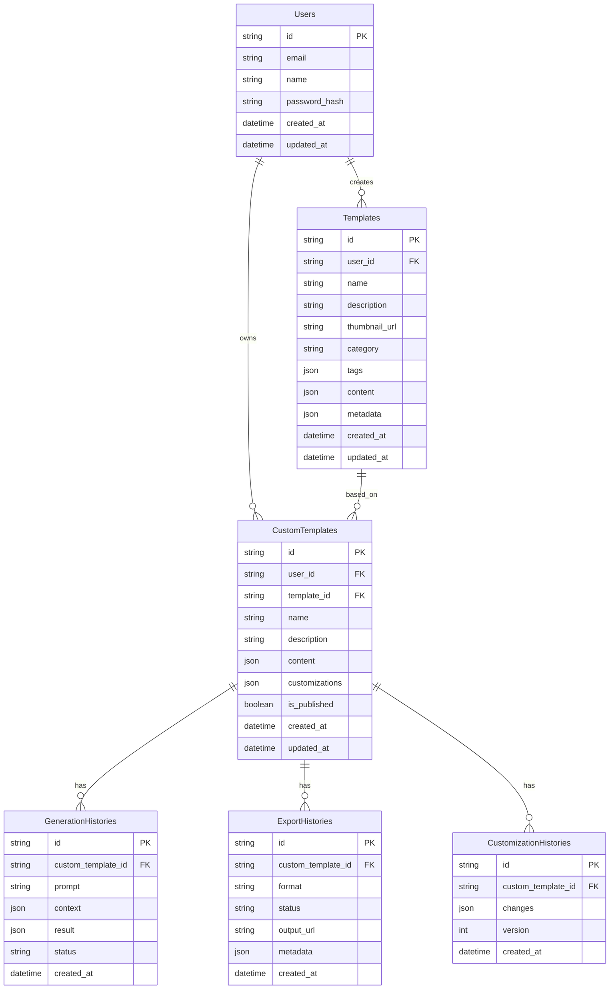

# データベース定義書

## ER 図

## テーブル定義

### Users（ユーザー）

| カラム名      | 型       | NULL | 説明                     |
| ------------- | -------- | ---- | ------------------------ |
| id            | string   | NO   | プライマリーキー、UUID   |
| email         | string   | NO   | メールアドレス、ユニーク |
| name          | string   | NO   | ユーザー名               |
| password_hash | string   | NO   | パスワードハッシュ       |
| created_at    | datetime | NO   | 作成日時                 |
| updated_at    | datetime | NO   | 更新日時                 |

### Templates（テンプレート）

| カラム名      | 型       | NULL | 説明                                   |
| ------------- | -------- | ---- | -------------------------------------- |
| id            | string   | NO   | プライマリーキー、UUID                 |
| user_id       | string   | YES  | 作成者 ID（NULL=システムテンプレート） |
| name          | string   | NO   | テンプレート名                         |
| description   | string   | NO   | 説明                                   |
| thumbnail_url | string   | NO   | サムネイル画像 URL                     |
| category      | string   | NO   | カテゴリー                             |
| tags          | json     | YES  | タグ配列                               |
| content       | json     | NO   | テンプレートの内容（HTML/CSS）         |
| metadata      | json     | YES  | メタデータ                             |
| created_at    | datetime | NO   | 作成日時                               |
| updated_at    | datetime | NO   | 更新日時                               |

### CustomTemplates（カスタマイズされたテンプレート）

| カラム名       | 型       | NULL | 説明                   |
| -------------- | -------- | ---- | ---------------------- |
| id             | string   | NO   | プライマリーキー、UUID |
| user_id        | string   | NO   | 所有者 ID              |
| template_id    | string   | NO   | 元テンプレート ID      |
| name           | string   | NO   | プロジェクト名         |
| description    | string   | YES  | 説明                   |
| content        | json     | NO   | カスタマイズされた内容 |
| customizations | json     | NO   | カスタマイズ設定       |
| is_published   | boolean  | NO   | 公開フラグ             |
| created_at     | datetime | NO   | 作成日時               |
| updated_at     | datetime | NO   | 更新日時               |

### GenerationHistories（生成履歴）

| カラム名           | 型       | NULL | 説明                    |
| ------------------ | -------- | ---- | ----------------------- |
| id                 | string   | NO   | プライマリーキー、UUID  |
| custom_template_id | string   | NO   | カスタムテンプレート ID |
| prompt             | string   | NO   | 生成プロンプト          |
| context            | json     | YES  | 生成コンテキスト        |
| result             | json     | NO   | 生成結果                |
| status             | string   | NO   | 生成ステータス          |
| created_at         | datetime | NO   | 作成日時                |

### CustomizationHistories（カスタマイズ履歴）

| カラム名           | 型       | NULL | 説明                    |
| ------------------ | -------- | ---- | ----------------------- |
| id                 | string   | NO   | プライマリーキー、UUID  |
| custom_template_id | string   | NO   | カスタムテンプレート ID |
| changes            | json     | NO   | 変更内容                |
| version            | int      | NO   | バージョン番号          |
| created_at         | datetime | NO   | 作成日時                |

### ExportHistories（エクスポート履歴）

| カラム名           | 型       | NULL | 説明                    |
| ------------------ | -------- | ---- | ----------------------- |
| id                 | string   | NO   | プライマリーキー、UUID  |
| custom_template_id | string   | NO   | カスタムテンプレート ID |
| format             | string   | NO   | エクスポート形式        |
| status             | string   | NO   | エクスポートステータス  |
| output_url         | string   | YES  | 出力ファイル URL        |
| metadata           | json     | YES  | メタデータ              |
| created_at         | datetime | NO   | 作成日時                |

## インデックス

### Users

- email (UNIQUE)

### Templates

- user_id
- category
- tags

### CustomTemplates

- user_id
- template_id
- is_published

### GenerationHistories

- custom_template_id
- created_at

### CustomizationHistories

- custom_template_id
- version

### ExportHistories

- custom_template_id
- created_at

## 制約

### 外部キー制約

1. CustomTemplates.user_id → Users.id
2. CustomTemplates.template_id → Templates.id
3. GenerationHistories.custom_template_id → CustomTemplates.id
4. CustomizationHistories.custom_template_id → CustomTemplates.id
5. ExportHistories.custom_template_id → CustomTemplates.id

### その他の制約

1. Users.email は有効なメールアドレス形式
2. Templates.category は定義された値のみ
3. GenerationHistories.status は ['pending', 'processing', 'completed', 'failed'] のいずれか
4. ExportHistories.status は ['pending', 'processing', 'completed', 'failed'] のいずれか
5. ExportHistories.format は ['html', 'static', 'wordpress'] のいずれか
   </rewritten_file>
