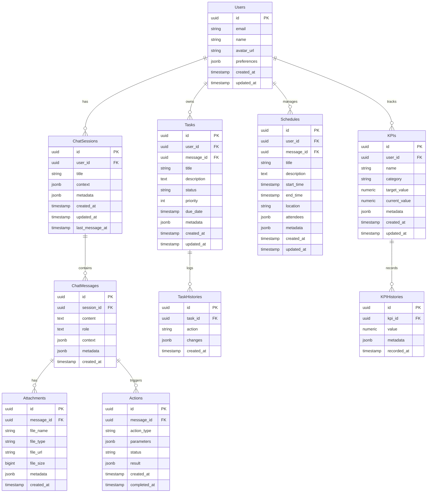

# COO 前田くん AI データベース定義書

## ER 図



## テーブル定義

### Users（ユーザー）

| カラム名    | 型        | NULL | 説明                 |
| ----------- | --------- | ---- | -------------------- |
| id          | uuid      | NO   | プライマリーキー     |
| email       | string    | NO   | メールアドレス       |
| name        | string    | NO   | 名前                 |
| avatar_url  | string    | YES  | プロフィール画像 URL |
| preferences | jsonb     | YES  | ユーザー設定         |
| created_at  | timestamp | NO   | 作成日時             |
| updated_at  | timestamp | NO   | 更新日時             |

### ChatSessions（チャットセッション）

| カラム名        | 型        | NULL | 説明                   |
| --------------- | --------- | ---- | ---------------------- |
| id              | uuid      | NO   | プライマリーキー       |
| user_id         | uuid      | NO   | ユーザー ID            |
| title           | string    | YES  | セッションタイトル     |
| context         | jsonb     | YES  | セッションコンテキスト |
| metadata        | jsonb     | YES  | メタデータ             |
| created_at      | timestamp | NO   | 作成日時               |
| updated_at      | timestamp | NO   | 更新日時               |
| last_message_at | timestamp | NO   | 最終メッセージ日時     |

### ChatMessages（チャットメッセージ）

| カラム名   | 型        | NULL | 説明                   |
| ---------- | --------- | ---- | ---------------------- |
| id         | uuid      | NO   | プライマリーキー       |
| session_id | uuid      | NO   | セッション ID          |
| content    | text      | NO   | メッセージ内容         |
| role       | text      | NO   | user/assistant         |
| context    | jsonb     | YES  | メッセージコンテキスト |
| metadata   | jsonb     | YES  | メタデータ             |
| created_at | timestamp | NO   | 作成日時               |

### Actions（アクション）

| カラム名     | 型        | NULL | 説明             |
| ------------ | --------- | ---- | ---------------- |
| id           | uuid      | NO   | プライマリーキー |
| message_id   | uuid      | NO   | メッセージ ID    |
| action_type  | string    | NO   | アクション種別   |
| parameters   | jsonb     | YES  | パラメータ       |
| status       | string    | NO   | 実行状態         |
| result       | jsonb     | YES  | 実行結果         |
| created_at   | timestamp | NO   | 作成日時         |
| completed_at | timestamp | YES  | 完了日時         |

### Tasks（タスク）

| カラム名    | 型        | NULL | 説明                |
| ----------- | --------- | ---- | ------------------- |
| id          | uuid      | NO   | プライマリーキー    |
| user_id     | uuid      | NO   | ユーザー ID         |
| message_id  | uuid      | YES  | 作成元メッセージ ID |
| title       | string    | NO   | タスクタイトル      |
| description | text      | YES  | 詳細説明            |
| status      | string    | NO   | ステータス          |
| priority    | int       | NO   | 優先度              |
| due_date    | timestamp | YES  | 期限                |
| metadata    | jsonb     | YES  | メタデータ          |
| created_at  | timestamp | NO   | 作成日時            |
| updated_at  | timestamp | NO   | 更新日時            |

### TaskHistories（タスク履歴）

| カラム名   | 型        | NULL | 説明             |
| ---------- | --------- | ---- | ---------------- |
| id         | uuid      | NO   | プライマリーキー |
| task_id    | uuid      | NO   | タスク ID        |
| action     | string    | NO   | アクション種別   |
| changes    | jsonb     | NO   | 変更内容         |
| created_at | timestamp | NO   | 作成日時         |

### Schedules（スケジュール）

| カラム名    | 型        | NULL | 説明                |
| ----------- | --------- | ---- | ------------------- |
| id          | uuid      | NO   | プライマリーキー    |
| user_id     | uuid      | NO   | ユーザー ID         |
| message_id  | uuid      | YES  | 作成元メッセージ ID |
| title       | string    | NO   | 予定タイトル        |
| description | text      | YES  | 詳細説明            |
| start_time  | timestamp | NO   | 開始時間            |
| end_time    | timestamp | NO   | 終了時間            |
| location    | string    | YES  | 場所/URL            |
| attendees   | jsonb     | YES  | 参加者情報          |
| metadata    | jsonb     | YES  | メタデータ          |
| created_at  | timestamp | NO   | 作成日時            |
| updated_at  | timestamp | NO   | 更新日時            |

### KPIs（KPI 管理）

| カラム名      | 型        | NULL | 説明             |
| ------------- | --------- | ---- | ---------------- |
| id            | uuid      | NO   | プライマリーキー |
| user_id       | uuid      | NO   | ユーザー ID      |
| name          | string    | NO   | KPI 名           |
| category      | string    | NO   | カテゴリー       |
| target_value  | numeric   | NO   | 目標値           |
| current_value | numeric   | NO   | 現在値           |
| metadata      | jsonb     | YES  | メタデータ       |
| created_at    | timestamp | NO   | 作成日時         |
| updated_at    | timestamp | NO   | 更新日時         |

### KPIHistories（KPI 履歴）

| カラム名    | 型        | NULL | 説明             |
| ----------- | --------- | ---- | ---------------- |
| id          | uuid      | NO   | プライマリーキー |
| kpi_id      | uuid      | NO   | KPI ID           |
| value       | numeric   | NO   | 記録値           |
| metadata    | jsonb     | YES  | メタデータ       |
| recorded_at | timestamp | NO   | 記録日時         |

### Attachments（添付ファイル）

| カラム名   | 型        | NULL | 説明             |
| ---------- | --------- | ---- | ---------------- |
| id         | uuid      | NO   | プライマリーキー |
| message_id | uuid      | NO   | メッセージ ID    |
| file_name  | string    | NO   | ファイル名       |
| file_type  | string    | NO   | ファイルタイプ   |
| file_url   | string    | NO   | 保存 URL         |
| file_size  | bigint    | NO   | ファイルサイズ   |
| metadata   | jsonb     | YES  | メタデータ       |
| created_at | timestamp | NO   | 作成日時         |

## インデックス

### ChatSessions

- user_id
- last_message_at

### ChatMessages

- session_id
- created_at

### Actions

- message_id
- action_type
- status
- created_at

### Tasks

- user_id
- message_id
- status
- due_date

### Schedules

- user_id
- message_id
- start_time
- end_time

### KPIs

- user_id
- category

### Attachments

- message_id
- file_type

## 制約

### 外部キー制約

1. ChatSessions.user_id → Users.id
2. ChatMessages.session_id → ChatSessions.id
3. Actions.message_id → ChatMessages.id
4. Tasks.user_id → Users.id
5. Tasks.message_id → ChatMessages.id
6. Schedules.user_id → Users.id
7. Schedules.message_id → ChatMessages.id
8. KPIs.user_id → Users.id
9. KPIHistories.kpi_id → KPIs.id
10. Attachments.message_id → ChatMessages.id

### その他の制約

1. Tasks.status は ['未着手', '進行中', '完了', '保留'] のいずれか
2. Tasks.priority は 1-5 の整数
3. KPIs.category は定義された値のいずれか
4. Schedules.end_time > Schedules.start_time
5. Actions.status は ['pending', 'in_progress', 'completed', 'failed'] のいずれか

```

</rewritten_file>
```
