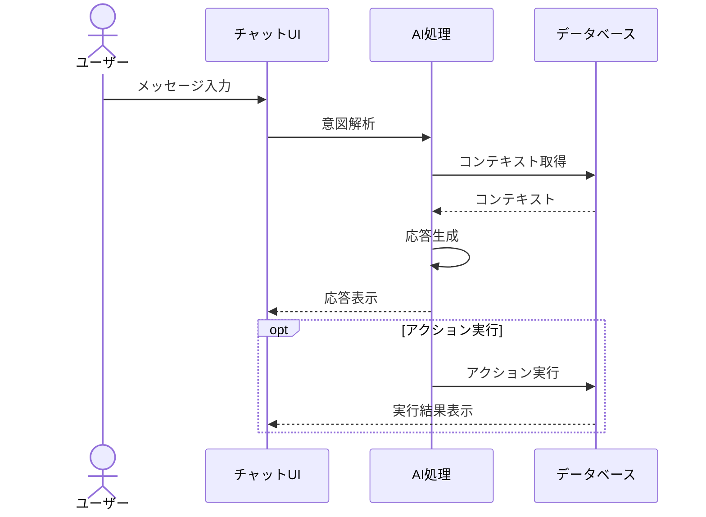
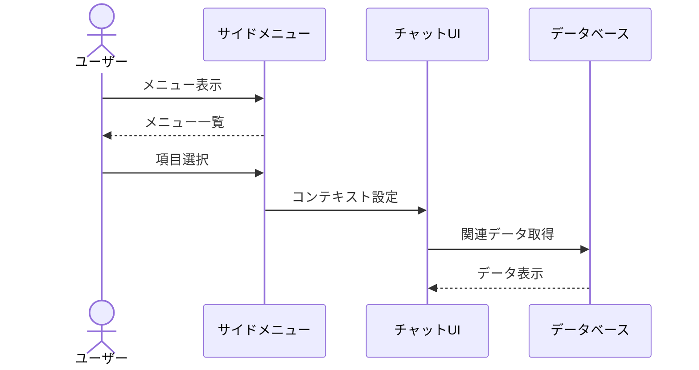
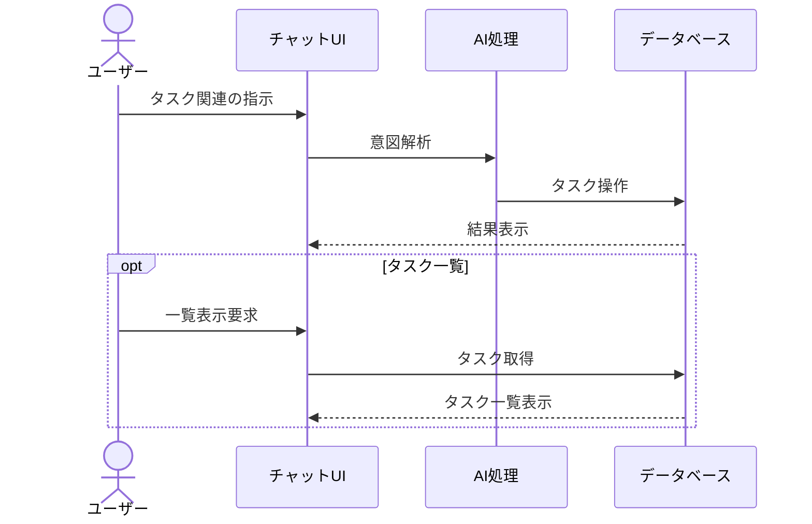
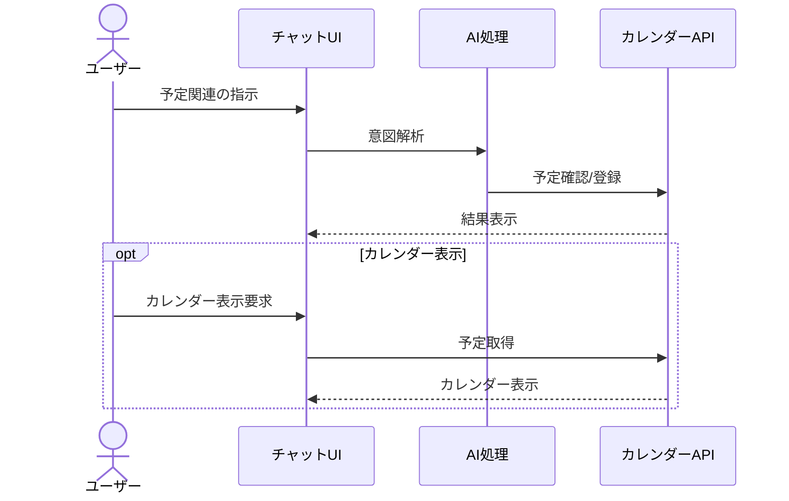
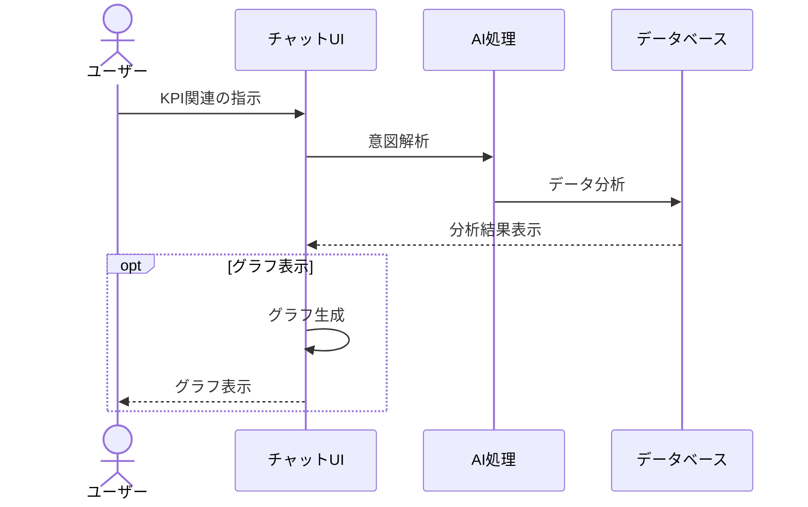
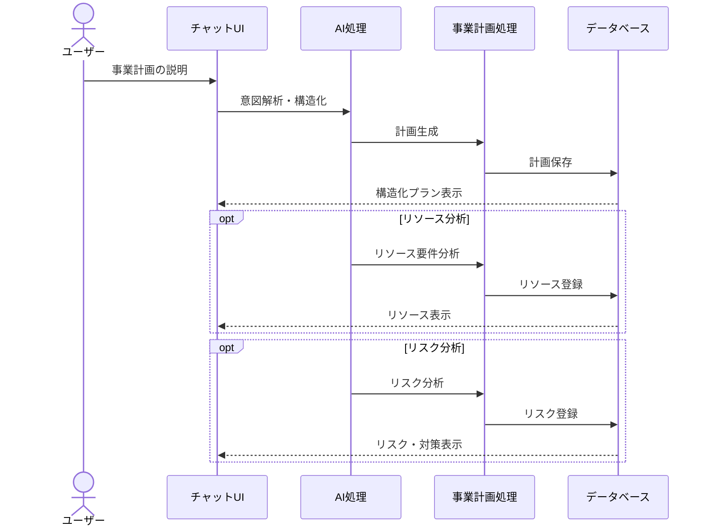
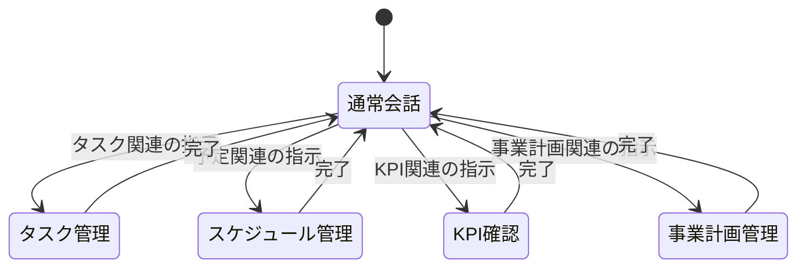
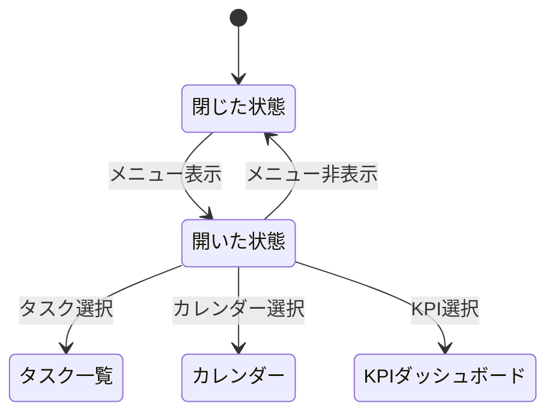
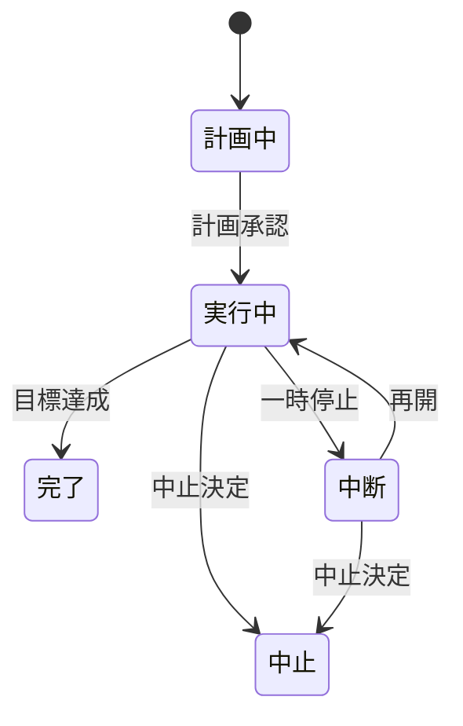

# COO 前田くん AI 操作フロー定義書

## 1. 基本操作フロー

### 1.1 チャットベースの操作

### 1.2 サイドメニュー操作

## 2. 機能別フロー

### 2.1 タスク管理

### 2.2 スケジュール管理

### 2.3 KPI 管理

### 2.4 事業計画管理

## 3. 状態遷移

### 3.1 チャットコンテキスト

### 3.2 サイドメニュー状態

### 3.2 事業計画状態

## 4. エラーハンドリング

### 4.1 入力エラー

1. 不明な指示の場合

   - AI が明確化を要求
   - 選択肢を提示

2. 必要情報の不足
   - AI が追加情報を要求
   - 具体例を提示

### 4.2 処理エラー

1. 実行エラー

   - エラー内容をわかりやすく表示
   - 代替案を提示

2. 権限エラー
   - 必要な権限を説明
   - 取得方法を案内

## 5. UI 表示ルール

### 5.1 メッセージ表示

- ユーザーメッセージ: 右寄せ、青系の背景
- AI メッセージ: 左寄せ、グレー系の背景
- システムメッセージ: 中央寄せ、薄い背景
- 事業計画表示: 構造化されたカード形式

### 5.2 アクション表示

- 実行中: プログレスインジケータ
- 完了: 緑のチェックマーク
- エラー: 赤の警告アイコン
- 計画フェーズ: 進捗バーとステータスアイコン

### 5.3 データ表示

- タスク: カード形式
- スケジュール: タイムライン形式
- KPI: グラフ/数値表示
- 事業計画:
  - フェーズ: ガントチャート
  - リソース: テーブル/グラフ
  - リスク: マトリックス表示

## 6. レスポンシブ対応

### 6.1 モバイル表示

- チャット中心の単一カラム
- スワイプでメニュー表示
- タップで詳細表示

### 6.2 デスクトップ表示

- チャット + サイドメニュー
- ドラッグ&ドロップ対応
- ホバーで詳細表示

## 7. ショートカット

### 7.1 キーボード操作

- Enter: メッセージ送信
- Ctrl + /: メニュー表示/非表示
- Esc: モーダル閉じる

### 7.2 ジェスチャー

- スワイプ右: メニュー表示
- スワイプ左: メニュー非表示
- ダブルタップ: 詳細表示
