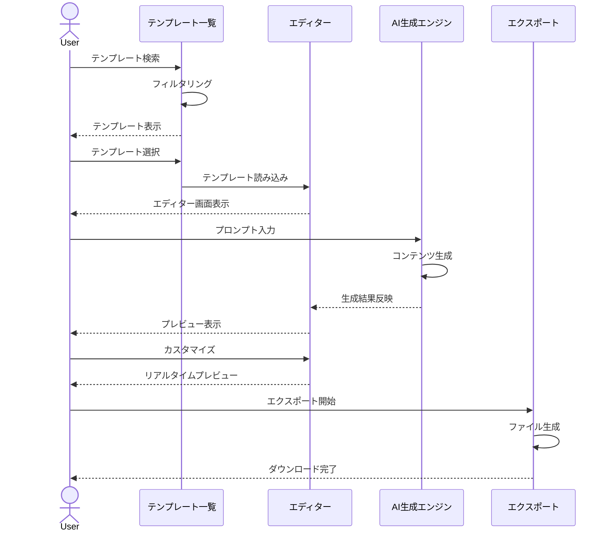
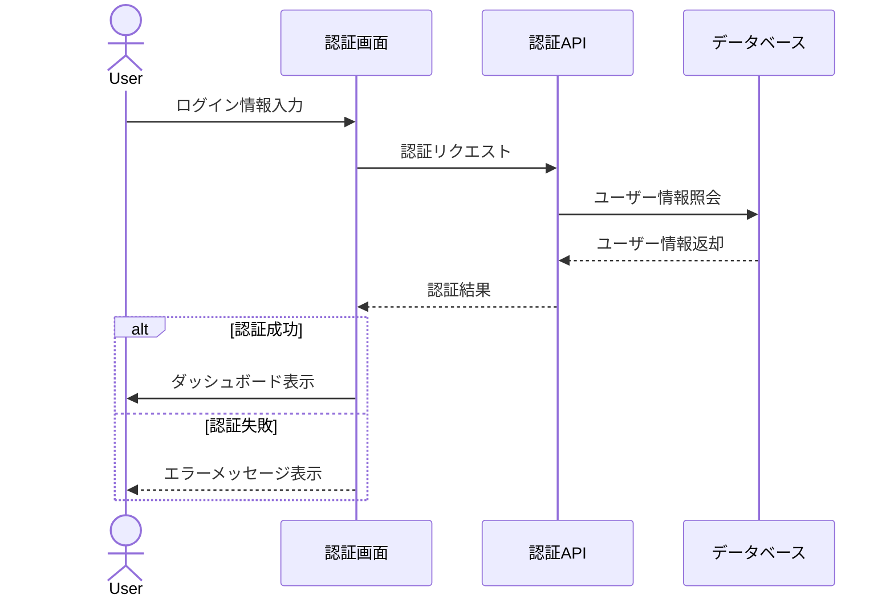
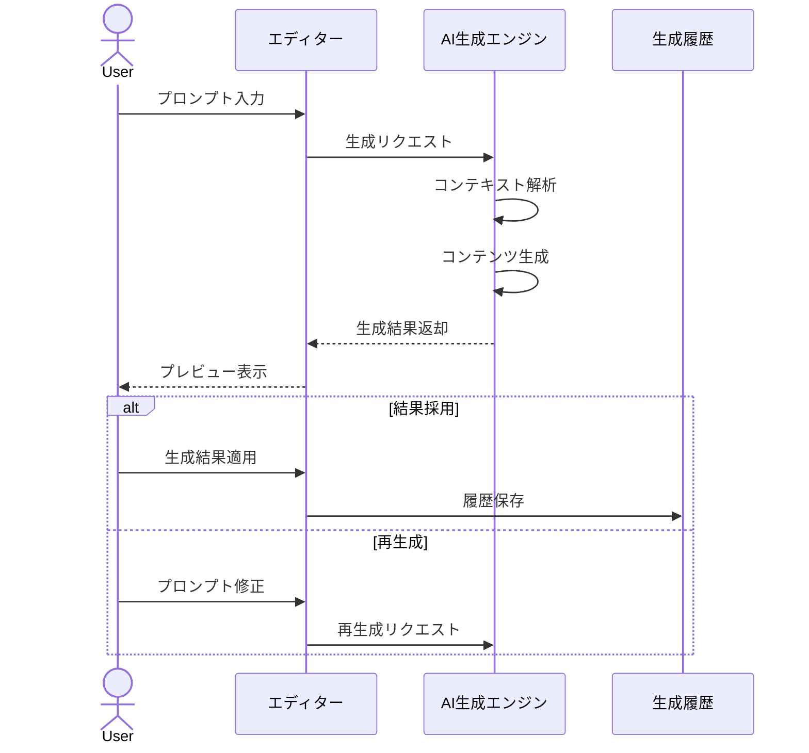
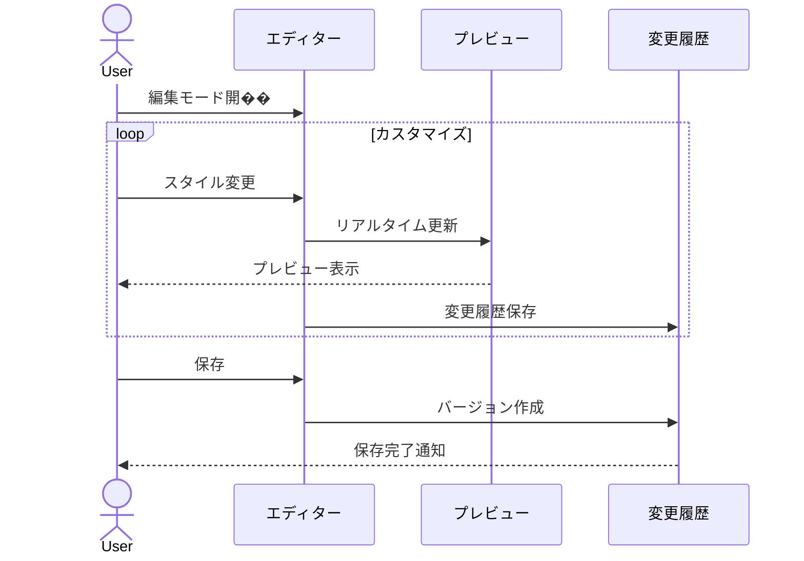
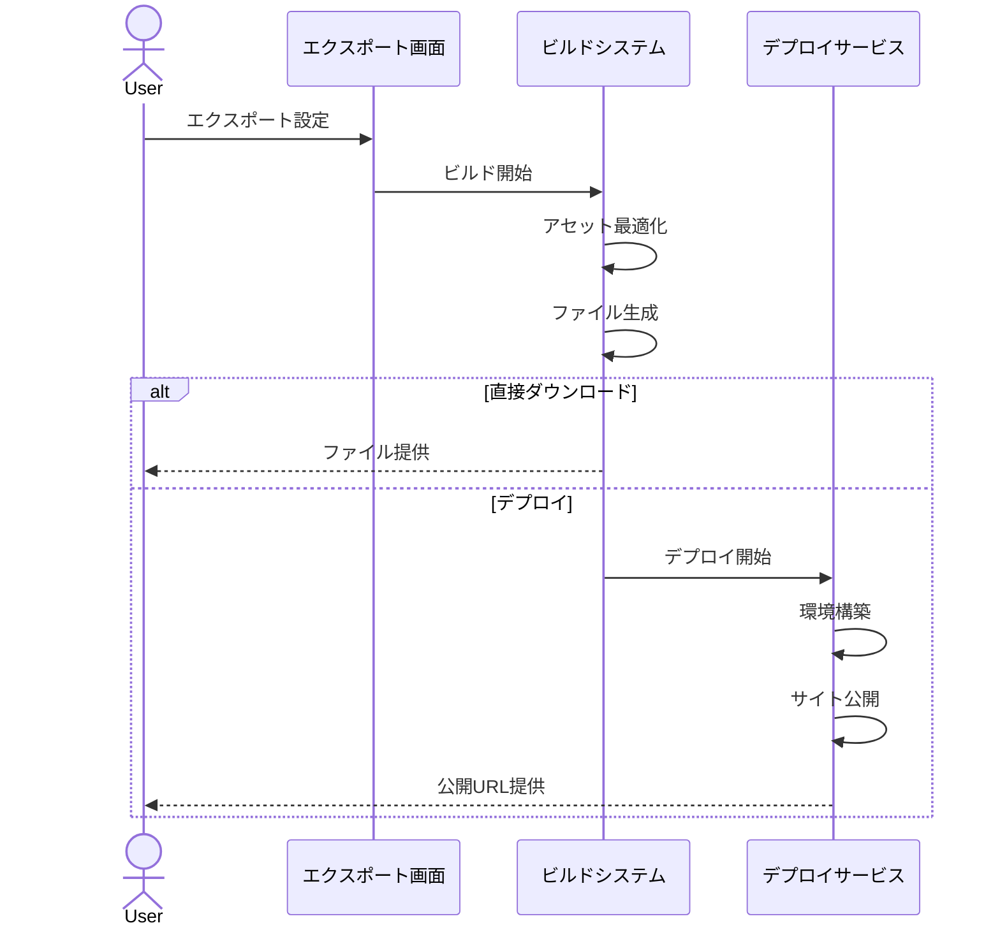
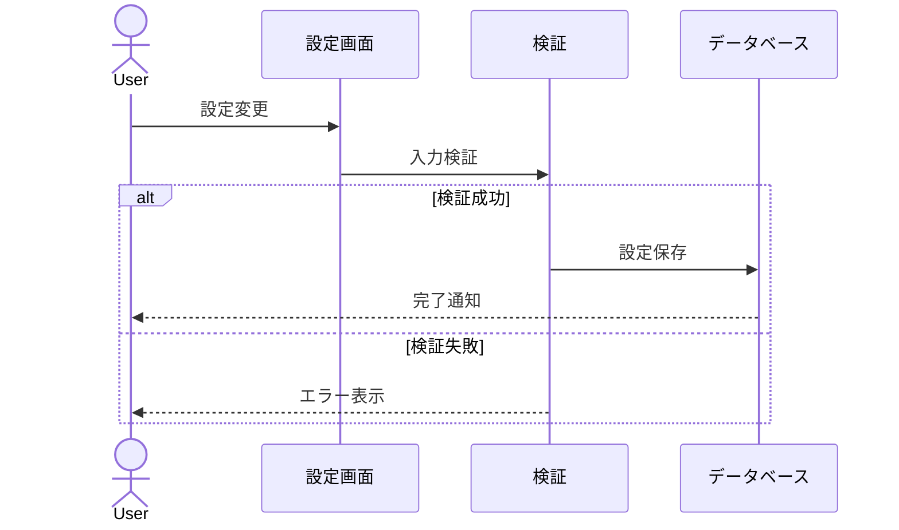

# 操作フロー定義

## 1. テンプレート選択から LP 生成まで

## 2. ユーザー認証フロー

## 3. AI コンテンツ生成フロー

## 4. カスタマイズフロー

## 5. エクスポート/デプロイフロー

## 6. 設定変更フロー

## 注意事項

1. エラーハンドリング

   - 各フローでエラー発生時の代替フローを用意
   - ユーザーへの適切なフィードバック提供
   - 自動リカバリーの実装

2. パフォーマンス最適化

   - 長時間処理の進捗表示
   - バックグラウンド処理の活用
   - キャッシュの適切な利用

3. セキュリティ考慮
   - セッション管理
   - 権限チェック
   - 入力値バリデーション
