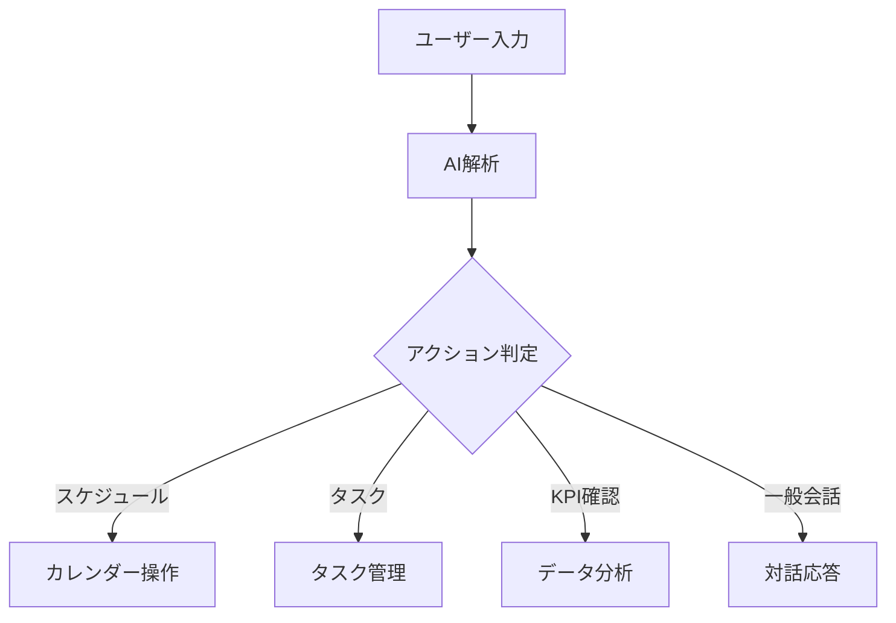

# COO 前田くん AI 画面定義書

## 1. 基本設計コンセプト

シンプルなチャットベースの UI を採用し、CEO が直感的に操作できる設計とします。
複雑な画面遷移やメニューを極力排除し、自然な会話を通じて必要な機能にアクセスできます。

## 2. メイン画面（チャットインターフェース）

### 2.1 基本レイアウト

```ascii
┌───────────────────────────────┐
│  [ヘッダー]  COO前田くんAI              │
├───────────────────────────────┤
│                                               │
│  [チャット履歴エリア]                         │
│   CEO: 今日の予定を教えて                     │
│   AI : 本日の予定は以下の通りです：           │
│        10:00 - クライアントMTG               │
│        14:00 - 経営戦略ミーティング          │
│                                               │
│   CEO: 売上の状況はどう？                     │
│   AI : 現在の売上状況をグラフで表示します：    │
│        [売上グラフ]                          │
│                                               │
│  [添付ファイル/画像表示エリア]                │
│                                               │
│  ┌─────────────────────────┐ │
│  │ メッセージを入力                          │ │
│  └─────────────────────────┘ │
└───────────────────────────────┘
```

### 2.2 主要コンポーネント

#### ヘッダー部分

- アプリロゴ
- 最小限のメニューアイコン（設定・通知用）
- ユーザープロフィールアイコン

#### チャット履歴エリア

- 時系列での対話表示
- テキスト、画像、グラフの表示
- スクロールで過去履歴の閲覧

#### 入力エリア

- テキスト入力フィールド
- 送信ボタン
- ファイル添付ボタン

## 3. サイドドロワーメニュー

```ascii
┌─────────────────────────┐
│ ≡ クイックビュー                │
├─────────────────────────┤
│ 1. タスク一覧                   │
│    ● 新規事業企画 (20%)        │
│    ● MTG準備 (0%)              │
│    ● 経費精算 (50%)            │
│                                │
│ 2. 今週のスケジュール           │
│    12/22 10:00 A社MTG         │
│    12/22 14:00 戦略会議        │
│                                │
│ 3. KPIサマリー                 │
│    売上: 120% ↑               │
│    経費: 90%  ↓               │
│                                │
│ 4. 設定                        │
└─────────────────────────┘
```

## 4. モバイル対応

### 4.1 モバイルレイアウト

```ascii
┌─────────────┐
│ ≡ COO前田くん  👤 │
├─────────────┤
│  チャット履歴    │
│                 │
│                 │
│                 │
│                 │
│                 │
├─────────────┤
│ メッセージを入力  │
└─────────────┘
```

### 4.2 スワイプアクション

- 右スワイプ：サイドメニュー表示
- 左スワイプ：通知/設定表示

## 5. 機能アクセスフロー

### 5.1 基本的な対話パターン



### 5.2 データ表示パターン

- インラインでの情報表示
  - 簡易グラフ
  - リスト表示
  - ステータス表示
- 詳細情報へのリンク

## 6. アクセシビリティ・UX

### 6.1 基本対応

- 音声入力対応
- スクリーンリーダー対応
- キーボードショートカット

### 6.2 フィードバック

- 入力中インジケータ
- 送信完了通知
- エラー表示
- 処理中の進捗表示

## 7. 通知システム

### 7.1 プッシュ通知

- タスクリマインド
- スケジュールアラート
- KPI 目標達成通知

### 7.2 インアプリ通知

- チャット内メッセージ
- バッジ表示
- サウンド通知（オプション）

## 8. 設定画面（最小限）

```ascii
┌─────────────────────┐
│ 設定                        │
├─────────────────────┤
│ ● 通知設定                  │
│ ● アカウント情報             │
│ ● AI応答スタイル             │
│ ● データ連携                 │
│ ● ヘルプ・サポート           │
└─────────────────────┘
```

## 9. レスポンシブ対応

### デバイス別表示

- モバイル（~767px）
  - フルスクリーンチャット
  - スワイプナビゲーション
- タブレット（768px~1023px）
  - サイドバー選択表示
  - 拡張チャット表示
- デスクトップ（1024px~）
  - マルチカラムレイアウト
  - 拡張機能表示

## 10. エラー・フィードバック

### 10.1 エラー表示

- チャット内でのエラーメッセージ
- リカバリーアクションの提案
- ヘルプガイダンス

### 10.2 ローディング表示

- メッセージ送信中
- ファイル処理中
- AI 応答生成中
