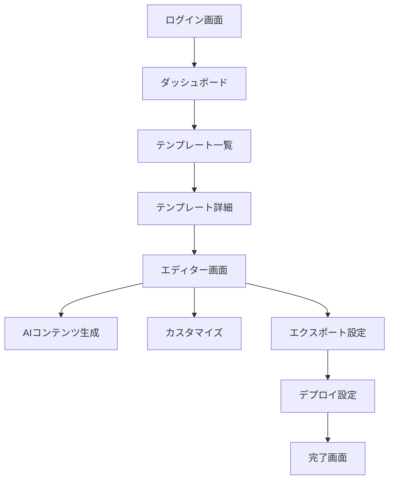
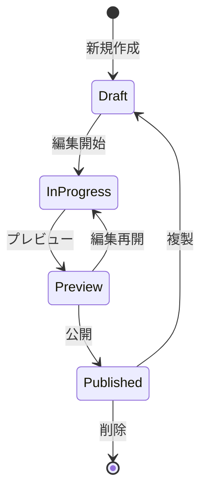
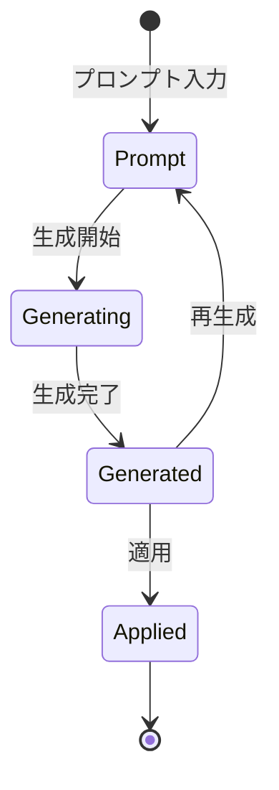

# 画面定義書

## 1. 共通レイアウト

### ヘッダー

- ロゴ
- メインナビゲーション
  - テンプレート一覧
  - マイプロジェクト
  - 設定
- ユーザーメニュー
  - プロフィール
  - ログアウト

### フッター

- コピーライト
- 利用規約
- プライバシーポリシー
- お問い合わせ

## 2. 画面一覧

### 2.1 認証画面

#### ログイン画面

- メールアドレス入力
- パスワード入力
- ログインボタン
- SNS ログインボタン（Google, GitHub）
- パスワードリセットリンク
- 新規登録リンク

#### 新規登録画面

- メールアドレス入力
- パスワード入力
- パスワード確認入力
- 利用規約同意チェックボックス
- 登録ボタン
- SNS 登録ボタン（Google, GitHub）
- ログインリンク

### 2.2 メイン画面

#### ダッシュボード

- 最近のプロジェクト一覧
- お気に入りテンプレート
- 使用状況統計
- お知らせ

#### テンプレート一覧画面

- 検索バー
- フィルター
  - カテゴリー
  - タグ
  - 業種
- テンプレートカード
  - サムネイル
  - タイトル
  - 説明
  - タグ
  - 使用回数
- ソート機能
- ページネーション

#### テンプレート詳細画面

- テンプレートプレビュー
- テンプレート情報
  - タイトル
  - 説明
  - 作者
  - 作成日
  - 更新日
- カスタマイズ開始ボタン
- お気に入りボタン

### 2.3 エディター画面

#### メインエディター

- プレビューエリア
  - デスクトップ/モバイル切り替え
  - ズーム機能
- サイドパネル
  - セクション一覧
  - コンポーネントパレット
  - プロパティエディター

#### AI コンテンツ生成パネル

- プロンプト入力
- コンテキスト設定
  - 業種選択
  - トーン選択
  - 長さ設定
- 生成履歴
- 再生成ボタン

#### カスタマイズパネル

- テキスト編集
- スタイル設定
  - カラーパレット
  - フォント設定
  - スペーシング
- レイアウト調整
  - グリッド設定
  - アライメント
  - マージン/パディング

### 2.4 エクスポート画面

#### エクスポート設定

- 出力形式選択
  - HTML/CSS
  - 静的サイト
  - WordPress テーマ
- 最適化オプション
  - ミニファイ
  - 画像最適化
- メタ情報設定
  - タイトル
  - 説明
  - OGP 設定

#### デプロイ設定

- プラットフォーム選択
  - Vercel
  - Netlify
- ドメイン設定
- 環境変数設定

## 3. 画面遷移フロー

## 4. 状態遷移

### 4.1 プロジェクト状態

### 4.2 AI 生成状態

## 5. レスポンシブ対応

### ブレイクポイント

- モバイル: ~767px
- タブレット: 768px~1023px
- デスクトップ: 1024px~

### 対応方 ���

- モバイルファースト設計
- フレックスボックスとグリッドレイアウトの活用
- タッチインターフェース最適化
- コンテンツの優先順位付け

## 6. アクセシビリティ対応

### WAI-ARIA

- ランドマーク
- ロール
- ステート
- プロパティ

### キーボード操作

- フォーカス管理
- ショートカットキー
- スキップリンク

### スクリーンリーダー

- 代替テキスト
- 見出し構造
- フォーム関連付け
